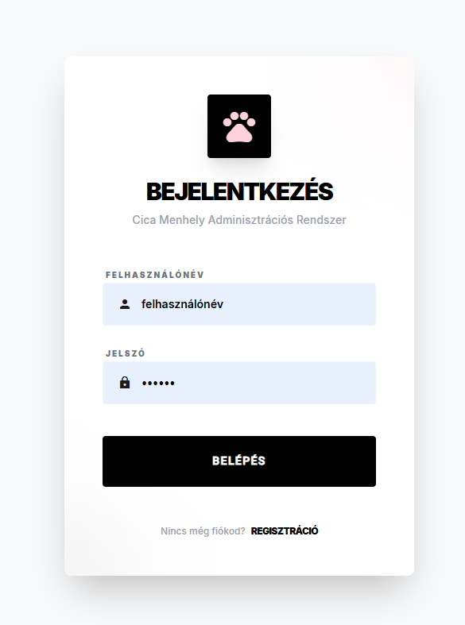
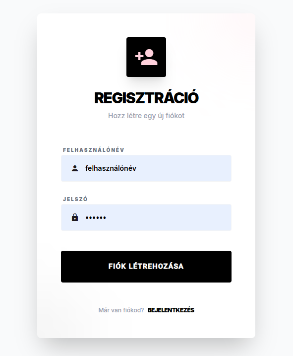
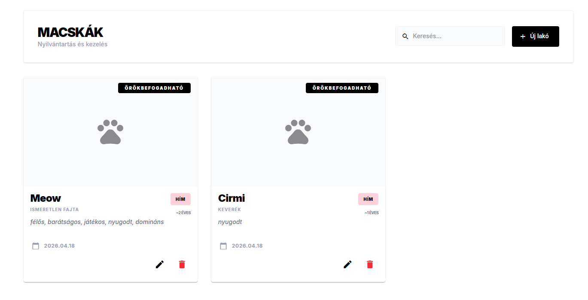
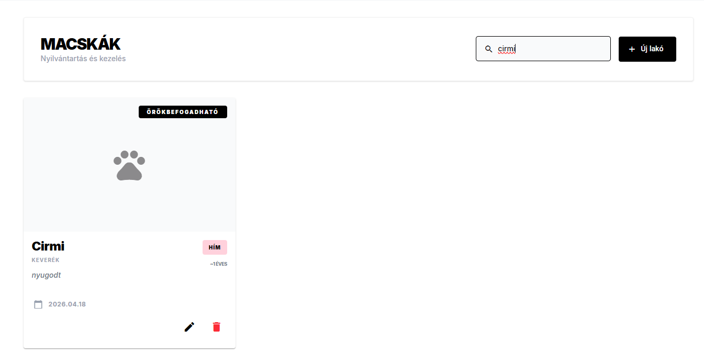
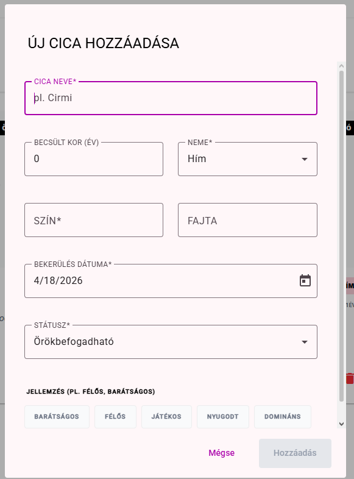
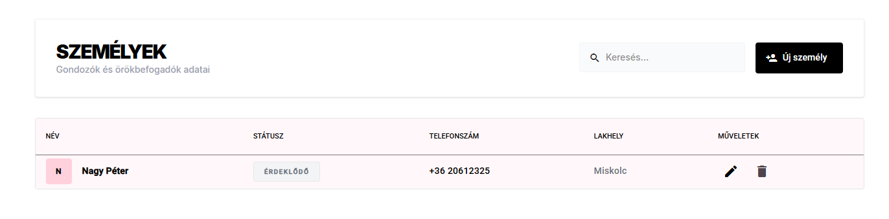
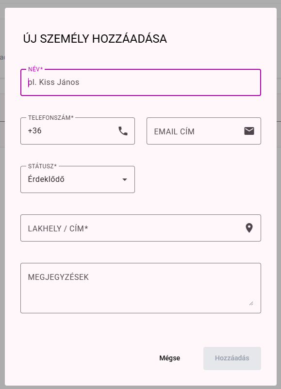
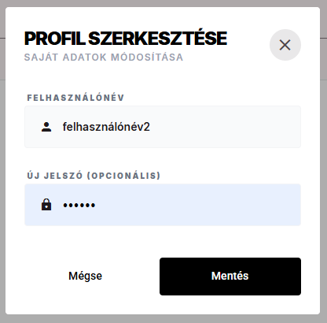

# Projekt Jegyzőkönyv: Cica Menhely Alkalmazás

## Tartalomjegyzék
1. [Bevezetés](#bevezetés)
    - [Projekt felépítése](#projekt-felépítése)
    - [Használt technológiák és nyelvek](#használt-technológiák-és-nyelvek)
2. [A projekt kódja](#a-projekt-kódja)
    - [Backend struktúra és adatmodellek](#backend-struktúra-és-adatmodellek)
    - [Autentikáció és biztonság](#autentikáció-és-biztonság)
    - [Frontend architektúra és szolgáltatások](#frontend-architektúra-és-szolgáltatások)
3. [Felhasználói útmutató](#felhasználói-útmutató)
    - [Belépés és regisztráció](#belépés-és-regisztráció)
    - [Cicák kezelése](#cicák-kezelése)
    - [Személyek (örökbefogadók) kezelése](#személyek-kezelése)
    - [Profil beállítások](#profil-beállítások)

---

## Bevezetés

### Projekt felépítése
A "Cica Menhely" alkalmazás egy modern, teljes körű (full-stack) webes megoldás, amely a menhelyek napi adminisztrációs feladatait könnyíti meg. Az alkalmazás két fő részből áll:
- **Backend:** Egy RESTful API, amely az adatok tárolásáért, validálásáért és a biztonságért felel.
- **Frontend:** Egy reszponzív Angular alapú felület, ahol a felhasználók könnyen kezelhetik a cicák és az örökbefogadók adatait.

### Használt technológiák és nyelvek
A projekt egységesen **TypeScript** nyelven íródott, mind a szerver, mind a kliens oldalon.

- **Frontend:** Angular 17+ (Signals, Standalone komponensek), Angular Material (UI komponensek).
- **Backend:** Node.js, Express keretrendszer.
- **Adatbázis:** MongoDB (Mongoose Object Modeling).
- **Biztonság:** JWT (JSON Web Token) alapú hitelesítés, Bcrypt jelszó titkosítás.

---

## A projekt kódja

### Backend struktúra és adatmodellek
Az adatok integritását a Mongoose sémák biztosítják. Példaként a `Cat` modell beépített validációval rendelkezik, amely megakadályozza, hogy hibás adatok kerüljenek a rendszerbe.

```typescript
// backend/models/Cat.ts részlet
const catSchema = new Schema<ICat>({
  name: { 
    type: String, 
    required: true,
    validate: {
      validator: (v: string) => /^[^0-9]*$/.test(v),
      message: 'A név nem tartalmazhat számokat.'
    }
  },
  status: { 
    type: String, 
    enum: ['örökbefogadható', 'örökbeadva', 'kezelés alatt', 'karantén'],
    default: 'örökbefogadható'
  },
  // További mezők...
});
```

### Autentikáció és biztonság
A felhasználók beléptetése JWT tokenek segítségével történik, a jelszavakat pedig soha nem tároljuk nyers formában.

```typescript
// backend/routes/authRoutes.ts részlet
const token = jwt.sign(
  { id: user._id, username: user.username },
  process.env.JWT_SECRET || 'secretkey',
  { expiresIn: '1d' }
);
```

### Frontend architektúra és szolgáltatások
A frontend az Angular legújabb funkcióit, például a **Signals**-t használja a reaktív állapotkezeléshez és a hatékony szűréshez.

```typescript
// src/app/components/cat-list/cat-list.ts részlet
protected readonly filteredCats = computed(() => {
  const query = this.searchQuery().toLowerCase().trim();
  if (!query) return this.cats();

  return this.cats().filter(cat => 
    cat.name.toLowerCase().includes(query) || 
    (cat.breed && cat.breed.toLowerCase().includes(query))
  );
});
```

---

## Felhasználói útmutató

### Belépés és regisztráció
Az alkalmazás használatához bejelentkezés szükséges. Új fiókot a regisztrációs oldalon hozhat létre az adminisztrátor vagy a kijelölt dolgozó.




### Cicák kezelése
A központi táblázatban látható az összes cica. Itt lehetőség van:
- **Keresésre:** Név vagy fajta alapján.
- **Új cica felvételére:** A jobb felső "Hozzáadás" gombbal.
- **Szerkesztésre/Törlésre:** Minden kártyán külön gombok találhatók.





### Személyek (örökbefogadók) kezelése
A "Személyek" menüpont alatt tarthatjuk nyilván az örökbefogadókat és a gondozókat. Fontos, hogy itt csak érvényes magyar telefonszámot és helyes email formátumot fogad el a rendszer.




### Profil beállítások
A bejelentkezett felhasználó a saját profilján módosíthatja a felhasználónevét vagy a jelszavát. A rendszer ellenőrzi, hogy a megadott új felhasználónév ne legyen foglalt.


